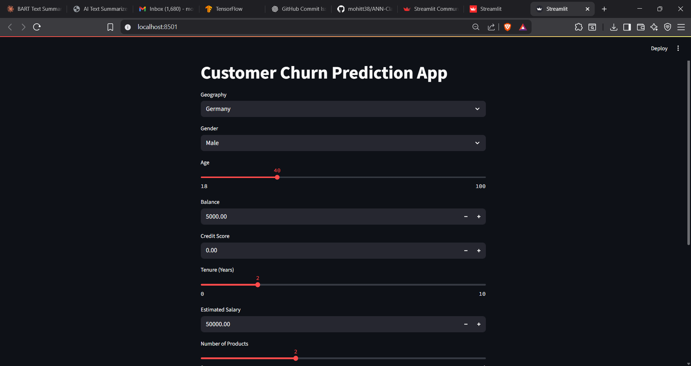

# 🔄 Customer Churn Prediction using Artificial Neural Networks (ANN)

This project is an end-to-end machine learning web application built with **TensorFlow**, **Streamlit**, and **Scikit-learn** to predict whether a customer will churn based on their information.

---

## 🚀 Live Demo

👉 https://churnpredictionmohit.streamlit.app/

## 📸 Screenshots

  

---

## 📌 Problem Statement

Businesses lose a lot of revenue due to customer churn. This project helps predict whether a customer is likely to churn using an Artificial Neural Network (ANN), enabling companies to take proactive measures.

---

## 📊 Features Used

- Credit Score  
- Age  
- Tenure  
- Balance  
- Number of Products  
- Has Credit Card  
- Is Active Member  
- Estimated Salary  
- Gender  
- Geography  

---

## 🛠️ Tech Stack

- **Frontend**: Streamlit  
- **Backend**: Python, TensorFlow (Keras), Scikit-learn  
- **Deployment**: Streamlit Cloud  
- **Data Handling**: Pandas, NumPy  
- **Visualization**: Matplotlib  

---

🧠 Model Training
The ANN model was built using TensorFlow and Keras with:

Input Layer with 11 features

2 Hidden Layers (ReLU activation)

Output Layer with Sigmoid activation

Optimizer: Adam

Loss Function: Binary Crossentropy

💡 Key Learnings
Building neural networks with TensorFlow

Deploying ML apps using Streamlit Cloud

Real-world classification problem handling

Understanding class imbalance & model evaluation

